# CMakeLearn与MSBuild学习笔记(1)

## 1. 简介
### 1.1 CMake
CMake是一个跨平台的用来编译C++的工具，具体的方法是通过编写`CMakeLists.txt`来控制编译的过程。

### 1.2 MSBuild

MSBuild是在Windows平台上用来编译C++工程的工具，可以在命令行使用。

## 2. CMake示例讲解

CMakeLists.txt
```cmake
#声明cmake的最低版本，必须有
cmake_minimum_required(VERSION 3.0)
#工程名称
project(CMakeDemo1)

#开启W3级编译警告，并将警告视为错误
add_compile_options(/W3 /WX)

SET(SOURCE_FILE main.cpp)
#用来区分32和64位
if(CMAKE_CL_64)
    #64位
    set(CMAKE_RUNTIME_OUTPUT_DIRECTORY_DEBUG ${PROJECT_SOURCE_DIR}/bin/Debug64/)    
    set(CMAKE_RUNTIME_OUTPUT_DIRECTORY_RELEASE ${PROJECT_SOURCE_DIR}/bin/Release64/)
else()
    #32位
    set(CMAKE_RUNTIME_OUTPUT_DIRECTORY_DEBUG ${PROJECT_SOURCE_DIR}/bin/Debug32/)    
    set(CMAKE_RUNTIME_OUTPUT_DIRECTORY_RELEASE ${PROJECT_SOURCE_DIR}/bin/Release32/)
endif()
add_executable(Demo1 ${SOURCE_FILE})
```

## 3. C++源代码

main.cpp
```cpp
#include <iostream>
int main(int argc,char * argv[])
{
    //消除参数未使用的警告
    std::cout<<argc<<"   "<<argv[0]<<std::endl;
    
    //程序名称
    std::cout<<"Cmake Demo 1"<<std::endl;
    
    //程序编译时间
    std::cout<<"Compile Time:     "<<__DATE__<<"  "<<__TIME__<<std::endl;
    
    //编译器版本VS适用
    std::cout<<"Compiler Version: "<<_MSC_VER<<std::endl;
    
    //判断程序是32位还是64位
    if(sizeof(int*)==4)
    {
        std::cout<<"32 Bit"<<std::endl;
    }
    else
    {
        std::cout<<"64 Bit"<<std::endl;
    }

    //判断大小端
    short int a = 0x1122;//十六进制，一个数值占4位
	char b =  *(char *)&a;  //通过将short(2字节)强制类型转换成char单字节，b指向a的起始字节（低字节）
	if( b == 0x11)//低字节存的是数据的高字节数据
	{
		std::cout<<"Big Endian"<<std::endl;
	}
	else
	{
		//是小端模式
        std::cout<<"Little Endian"<<std::endl;
	}
    //判断是Debug版本还是Release版本
#ifdef _DEBUG
    std::cout<<"Debug Mode"<<std::endl;
#else
    std::cout<<"Release Mode"<<std::endl;;
#endif
    return 0;
}
```

## 4.准备工作

### 4.1 CMake添加到Path
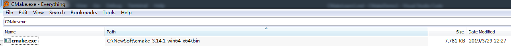

### 4.2 CMake添加到Path验证
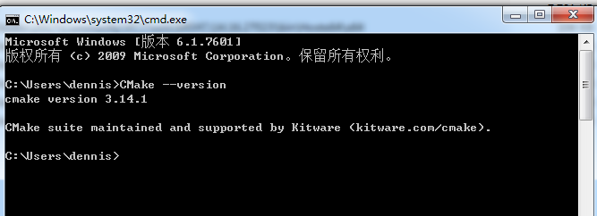

### 4.3 MSBuild添加到Path
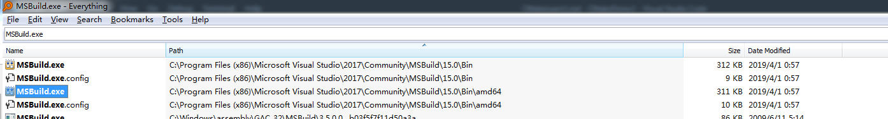
### 4.4 MSBuild添加到Path的验证
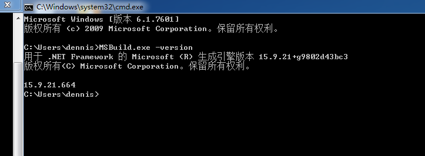

## 5.  32位手动编译全过程

### 5.1 进入到源码的目录
```
```
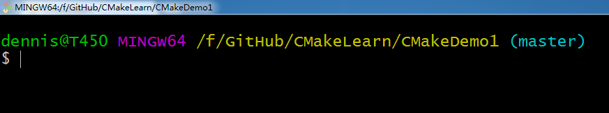
### 5.2 创建32位的编译目录，并进入该目录
```
mkdir Build32
cd Build32
```
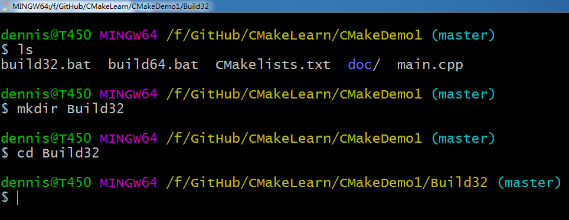

### 5.3 执行CMake生成32位版本

```
cmake ..
```
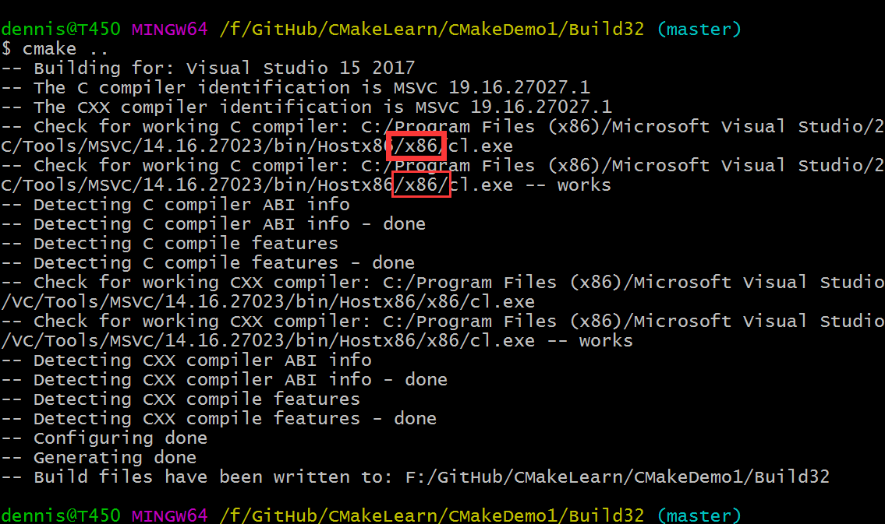

可以看到此处使用的是32位的编译器。

### 5.4 编译32位Debug的版本
```
MSBuild.exe Demo1.vcxproj -property:Configuration=Debug
```
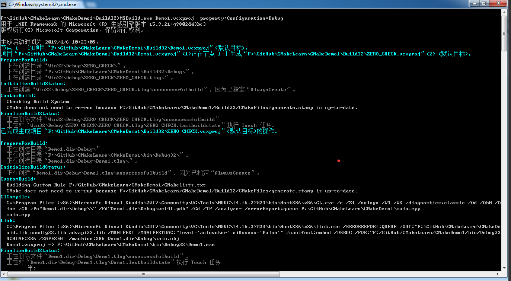
### 5.5 运行32位Debug的版本
```
cd ..
cd bin
cd Debug32
Demo1.exe
```
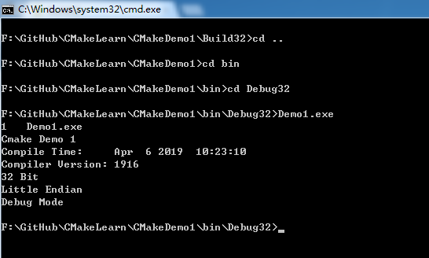

### 5.6 编译32位Release的版本
```
MSBuild.exe Demo1.vcxproj -property:Configuration=Release
```
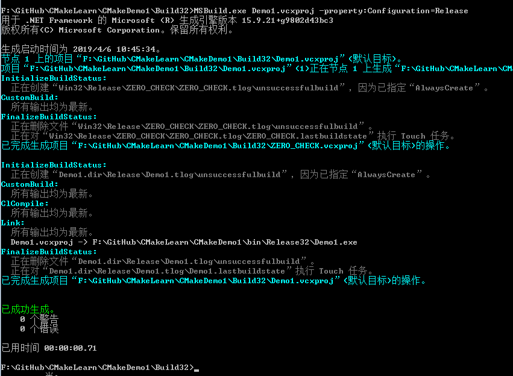
### 5.7 运行32位的Release版本
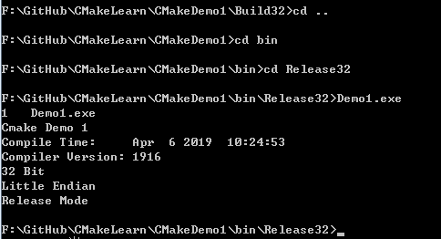


## 6.  64位的手动编译全过程
### 6.1 进入到源码的目录
同上

### 6.2 创建64位的编译目录，并进入该目录
```
mkdir Build64
cd Build64
```

### 6.3 执行CMake生成64位版本
```
cmake -G "Visual Studio 15 2017 Win64"
```
此处的`Visual Studio 15 2017`需要换成你的VS的编译器

### 6.4 编译64位Debug的版本
```
MSBuild.exe Demo1.vcxproj -property:Configuration=Debug
```
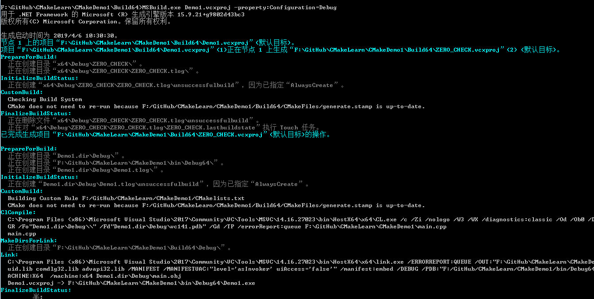

### 6.5 运行64位Debug的版本
```
cd ..
cd bin
cd Debug64
Demo1.exe
```
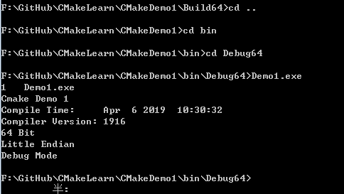

### 6.6 编译64位Release的版本
```
MSBuild.exe Demo1.vcxproj -property:Configuration=Release
```
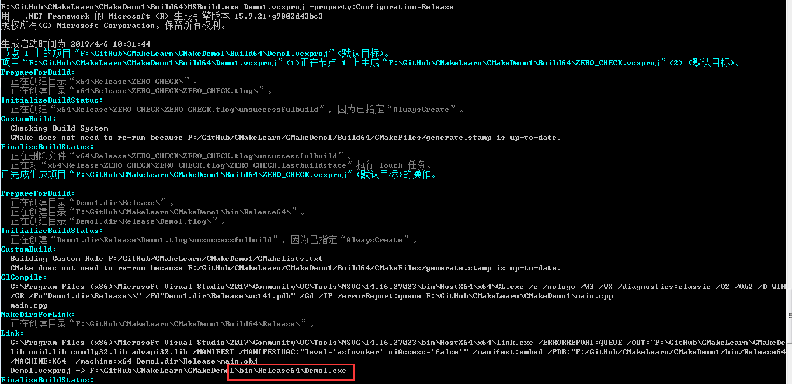
### 6.7 运行64位的Release版本
```
cd ..
cd bin
cd Release64
```
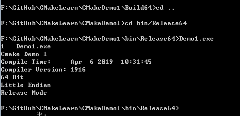